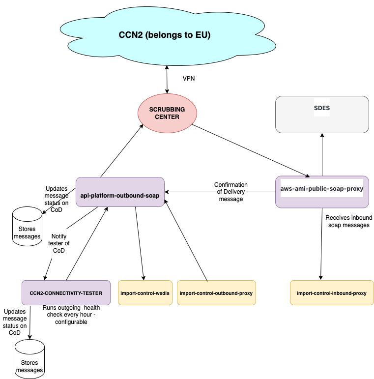

# CCN2 connectivity tester
## Overview
This service sends requests, on a configurable schedule, to [api-platform-outbound-soap](https://github.com/hmrc/api-platform-outbound-soap).
Upon receiving these requests api-platform-outbound-soap makes a SOAP request to the EU's CCN2 server, requesting a CoD.
Since these CoD (confirmation of delivery) messages are sent asynchronously, the receipt of one proves the entire round
trip from HMRC to CCN2 and in the other direction.



## How it works
Every time the timer fires, the service sends one V2 request. 
The requests look much like:
```
{
 "wsdlUrl": "https://import-control-wsdls.protected.mdtp/assets/eu/outbound/CR-for-NES-Services/BusinessActivityService/ICS/RiskAnalysisOrchestrationBAS/V2/CCN2.Service.Customs.Default.ICS.RiskAnalysisOrchestrationBAS_1.0.0_CCN2_1.0.0.wsdl",
 "wsdlOperation":"IsAlive",
 "messageBody":"", 
 "confirmationOfDelivery": true,
 "addressing": {
  "to":"partner:CCN2.Partner.EU.Customs.TAXUD/ICS_CR.CONF",
  "from":"partner:CCN2.Partner.EU.Customs.TAXUD/ICS_CR.CONF",
  "replyTo":"partner:CCN2.Partner.EU.Customs.TAXUD/ICS_CR.CONF",
  "faultTo":"partner:CCN2.Partner.EU.Customs.TAXUD/ICS_CR.CONF",
  "messageId":"ISALIVE-0123456789-V2"
  },
  "confirmationOfDelivery": true,
  "notificationUrl": "https://ccn2-connectivity-tester.mdtp.protected/notification"
}
```
An explanation of the various parts of this request can be found in the api-platform-outbound-soap service's README. 
The response to this request is stored by this service and when the requested confirmation of delivery message is received
on the notification endpoint, the message is marked as complete.

In the event that this confirmation should not be received, there is a further scheduled job which will pick up all the 
messages in this state and will log one message at `WARN` level for each of them.

If the request to api-platform-outbound-soap returns a `FAILED` status, this will be stored in Mongo then picked up by a 
scheduled job that will, again, log one message at `WARN` level for each instance. This same job will do the same for
any message which has had a `CoE` message delivered on the notification endpoint, since a `CoE` means that the request 
could not be processed by CCN2.


## How to run it locally
This service requires only `api-platform-outbound-soap` and `import-control-wsdls` to be running.
You can start these on the ports expected by the default configuration by running the included`run_local_with_dependencies.sh`. 
     

### License

This code is open source software licensed under the [Apache 2.0 License]("http://www.apache.org/licenses/LICENSE-2.0.html").